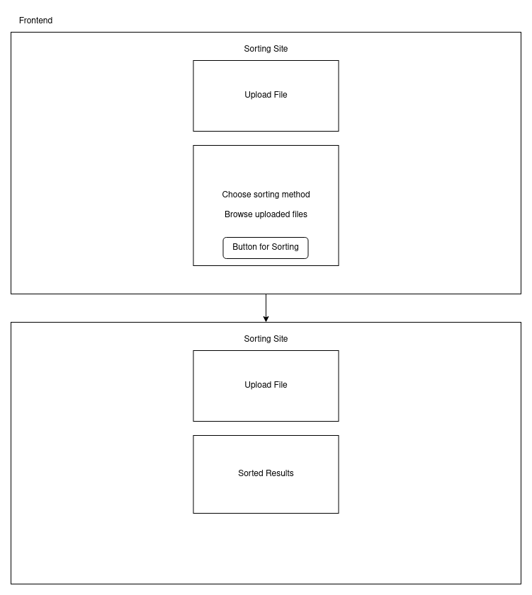
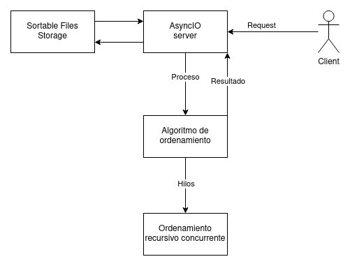

# final_c2
## Proyecto Final de Computacion II

>Servidor web asincrono que permite la subida de archivos de texto con secuencias de elementos numerados para ordenarlos a traves de algoritmos de ordenamiento

### **Librerias:**
- aiohttp
- concurrent futures
- argparse

### **Correr Proyecto Localmente:**

```bash
  git clone https://github.com/PvonK/final_c2
```


```bash
  cd final_c2
```

```bash
  pip3 install -r requirements.txt
```

```bash
  python3 main.py [-h] [-p PORT] [-d DIRECTORY]
```

### **Frontend**



### **Backend**

